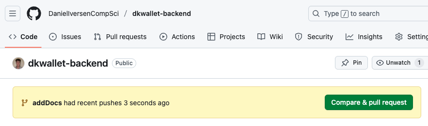
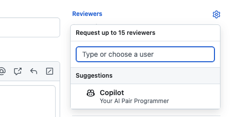
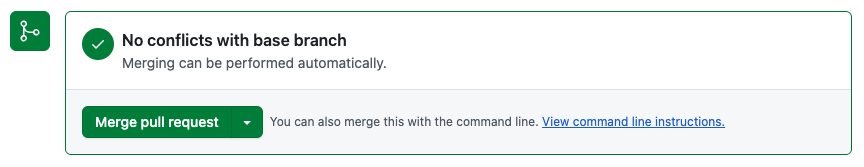
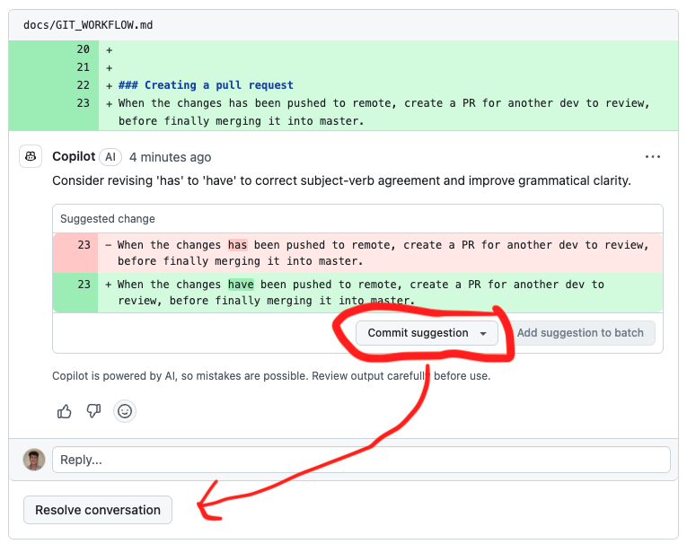
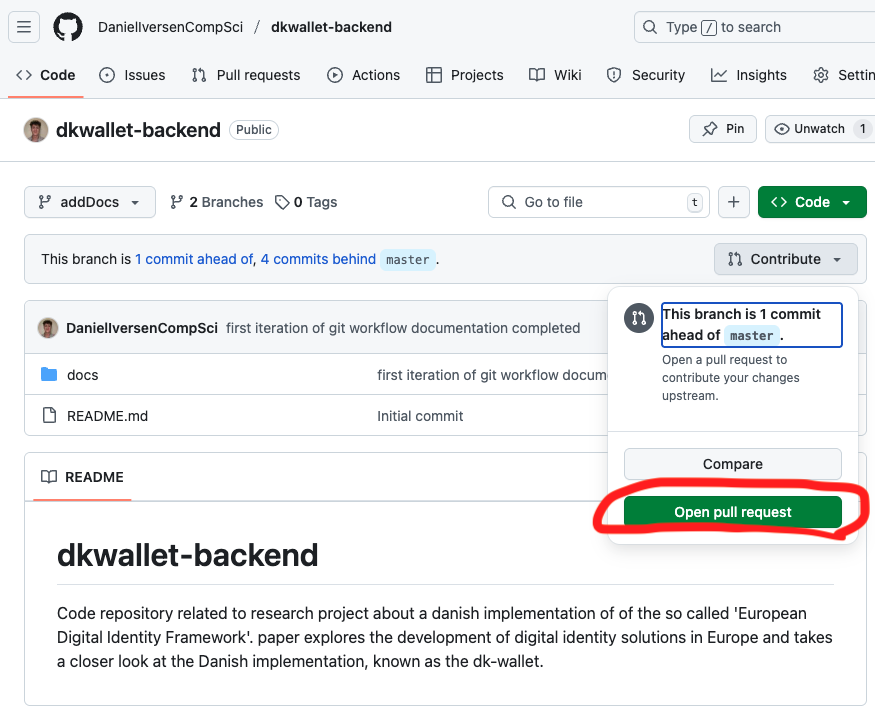
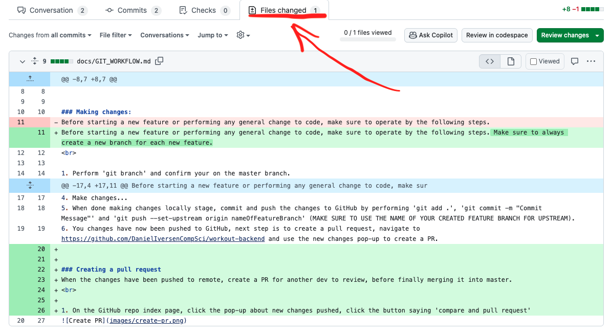

# Git Workflow documentation for DK Wallet research application development.

## Pull requests and pushing changes:
### How to contribute to the repository
* Open IDE and clone the repository: https://github.com/DanielIversenCompSci/dkwallet-backend
* Alternatively open a empty folder in you IDE and 'git init' followed by 'git remote add origin https://github.com/your-username/your-repo.git' in your terminal.

### Making changes:
Before starting a new feature or performing any general change to code, make sure to operate by the following steps. Make sure to always create a new branch for each new feature.
 

1. Perform 'git branch' and confirm your on the master branch.
2. Perform 'git pull origin master' to ensure your on the latest version before creating a feature branch.
3. Perform 'git checkout -b nameOfFeatureBranch' (MAKE SURE TO FOLLOW FEATURE BRANCH NAMING CONVENTIONS, SEE CODE_CONVENTIONS.md).
4. Make changes...
5. When done making changes locally stage, commit and push the changes to GitHub by performing 'git add .', 'git commit -m "Commit Message"' and 'git push --set-upstream origin nameOfFeatureBranch' (MAKE SURE TO USE THE NAME OF YOUR CREATED FEATURE BRANCH FOR UPSTREAM).
6. You changes have now been pushed to GitHub, next step is to create a pull request, navigate to https://github.com/DanielIversenCompSci/workout-backend and use the new changes pop-up to create a PR.

### Creating a pull request:
When the changes has been pushed to remote, create a PR for another dev to review, before finally merging it into master.
 

1. On the GitHub repo index page, click the pop-up about new changes pushed, click the button saying 'compare and pull request'.

2. Fill out the PR, be clear about what KANBAN workitem the feature relates to. Give any information relevant for the reviewer.
3. OPS! Before creating the PR make sure to add reviewers, in our case just add all remainings contributers since we are only three.

4. Wait for you PR to be reviewed. If reviewers have comments, they must be resolved. Finally merge the pull request, whereafter the feature branch should automatically be deleted from the GitHub repo.

5. If reviewers have comments, find them at the created PR. Resolve potential issues on your local feature branch and push again when finished to override the first push. If reviewers suggest the ideal solutions its also possible to commit suggestions directly in the PR thread.
6. Finally when the comments have been resolved either way, click 'Resolve conversation' followed by 'Merge pull request'.

7. OPS! Last important note, if pushing to a feature branch that recently completed a PR might mean the feature branch have not been autmatically deleted yet. To create a PR on a existing feature branch that has been used before: Go to the repo index page -> Under branches select the feature branch -> Click the contribute dropdown and click 'Open pull request'.

### Reviewing a pull request:
When a PR is made, some guidelines as a reviwer.
 

1. Inspect the changes pushed in the pull request, navigate to the PR and chose files changed in the nav menu.

2. Comments can be connected to lines of code by clicking the '+' sign at the left side of the line you with to comment on. This way you can comment lines of code and suggest better solutions.
3. In the main conversation page of the PR, specify what needs to be improved and whatever thoughts you have that might help.